# Manual de Usuario - Administrador

## 1. Acceso al Portal

1. Ingrese a `https://portal_proveedores.test/login`.
2. Complete correo y contraseña.
3. Presione **Ingresar**.

## 2. Vista General del Dashboard

Desde el dashboard puede revisar indicadores globales y accesos rápidos.

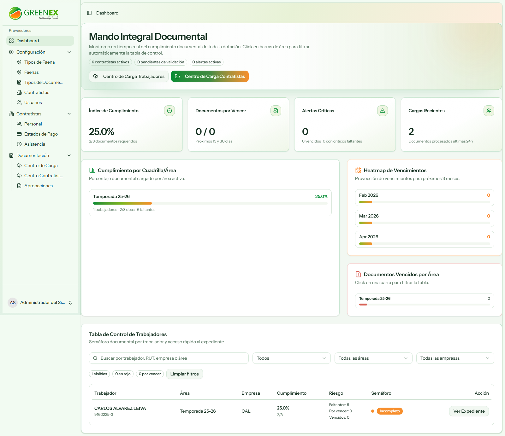

## 3. Menú Principal (Sidebar)

El orden de navegación para Administrador es:

1. Dashboard
2. Configuración
3. Contratistas
4. Documentación

## 4. Configuración

### 4.1 Tipos de Faena

Permite crear y mantener los tipos de faena del sistema.

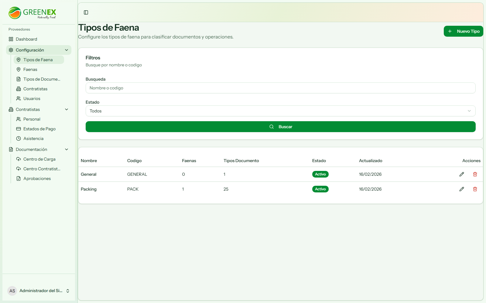

### 4.2 Faenas

Permite administrar faenas y asignaciones generales.

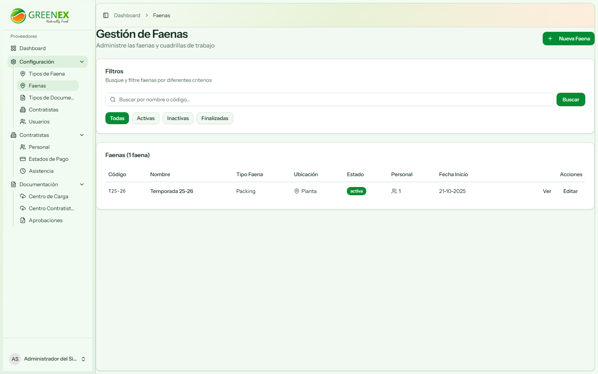

### 4.3 Tipos de Documentos

Permite definir documentos requeridos y sus reglas.

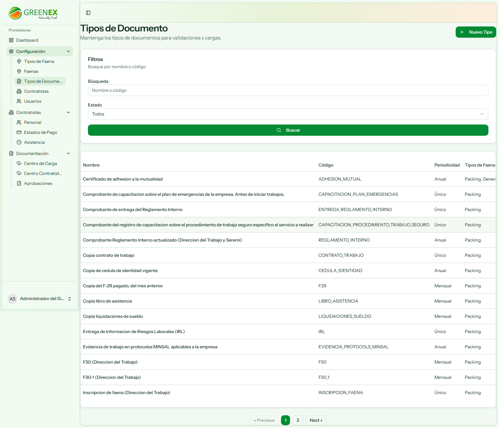

### 4.4 Contratistas

Gestión integral de empresas contratistas.

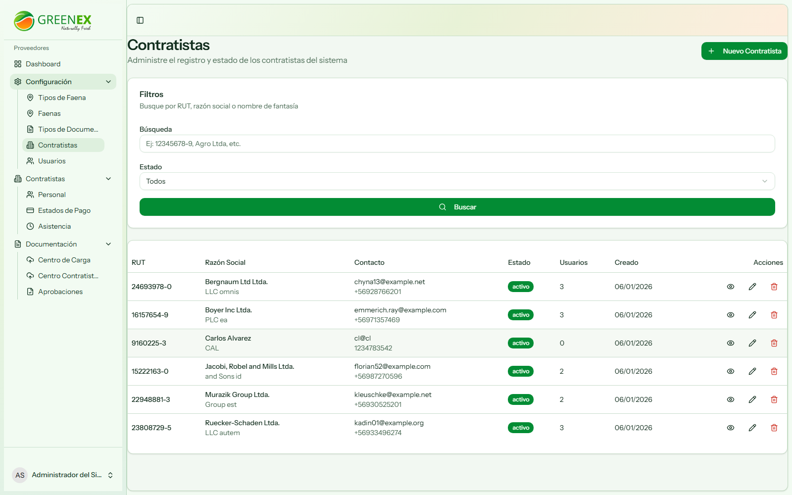

### 4.5 Usuarios

Administración de usuarios por rol y contratista.

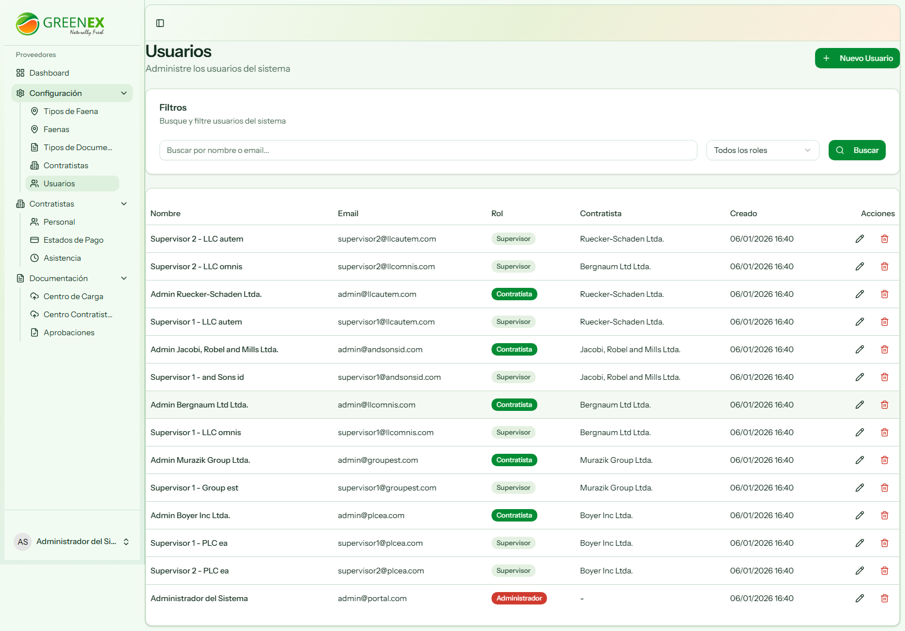

## 5. Módulo Contratistas

### 5.1 Personal

Listado y gestión de trabajadores.

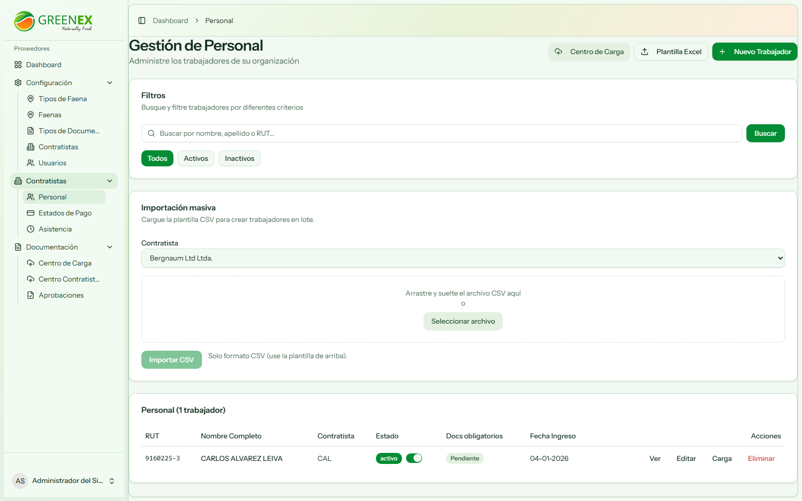

### 5.2 Estados de Pago

Control de estado de pago por contratista.

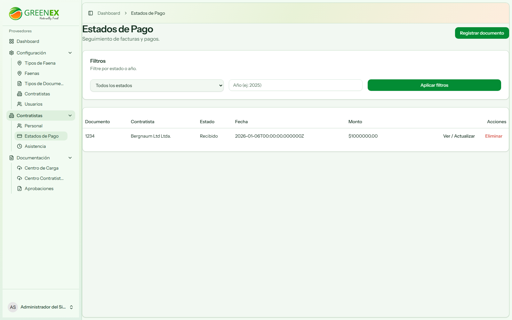

### 5.3 Asistencia

Registro y control de asistencia.

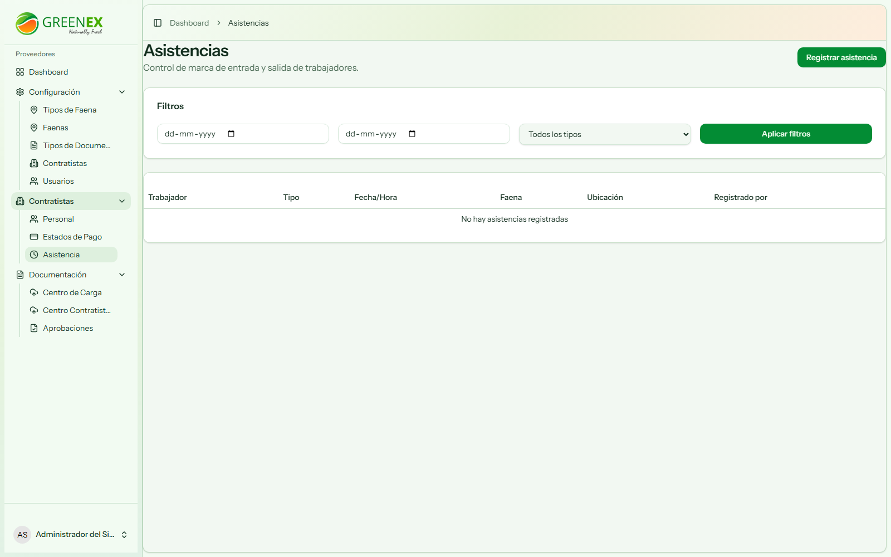

## 6. Módulo Documentación

### 6.1 Centro de Carga (Trabajadores)

Carga masiva/asistida de documentos de trabajadores con matching OCR.

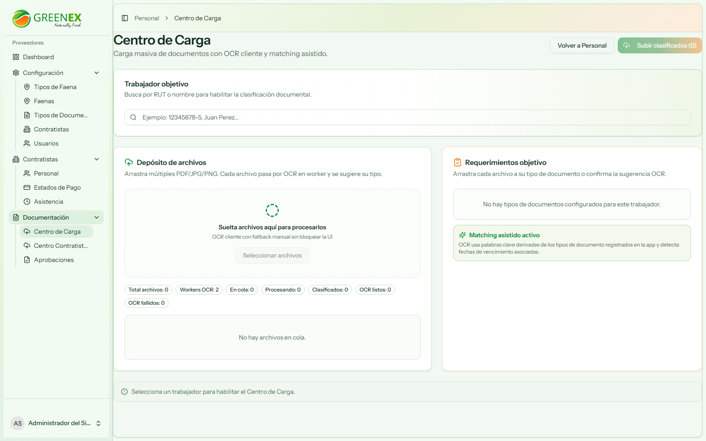

### 6.2 Centro Contratistas

Carga documental para requisitos de contratistas.

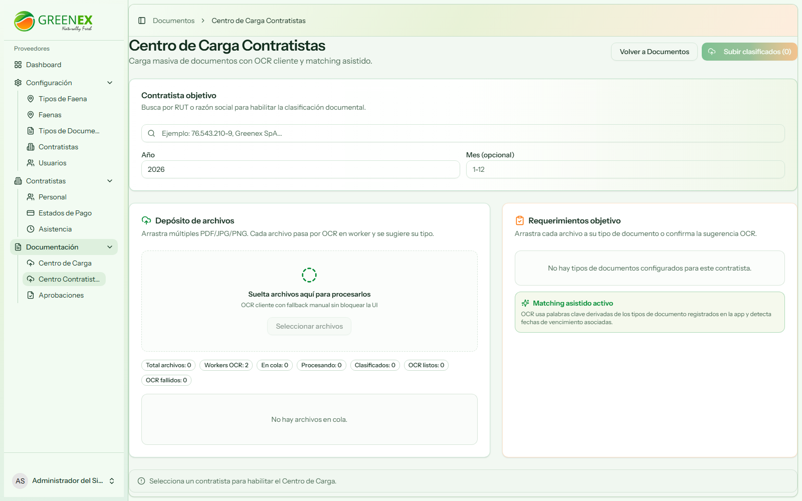

### 6.3 Aprobaciones

Bandeja de revisión y aprobación/rechazo documental.

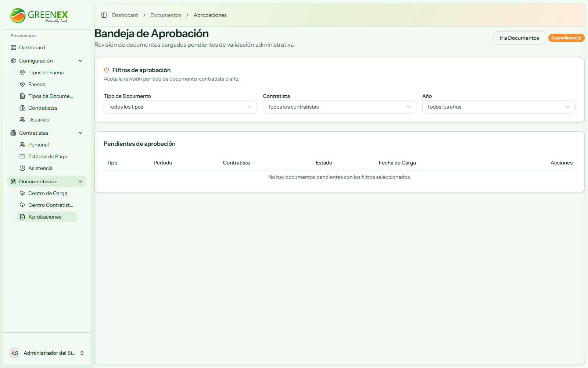

### 6.4 Expediente Documental

Visualización y filtros de documentos cargados.

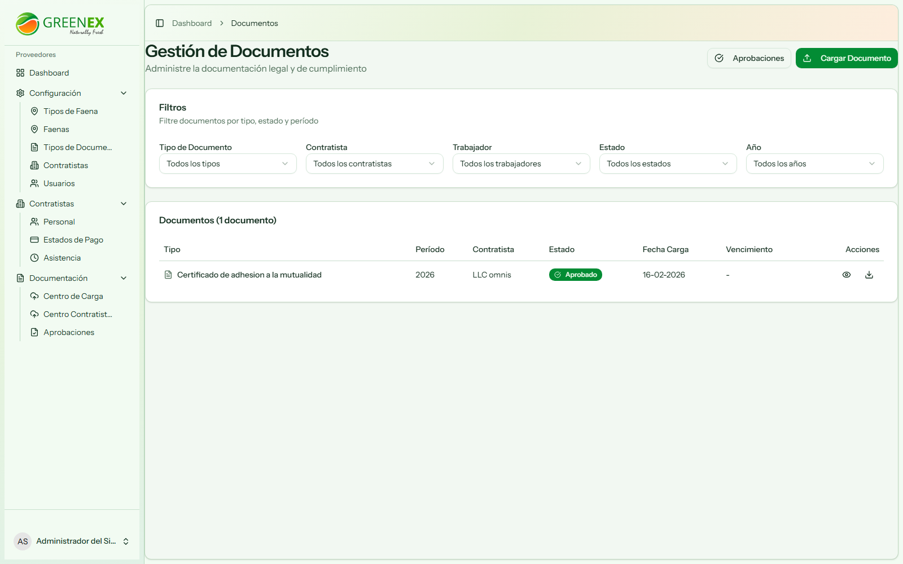

## 7. Flujo Recomendado de Operación (Administrador)

1. Configurar Tipos de Faena y Tipos de Documento.
2. Mantener contratistas y usuarios.
3. Monitorear cargas en Centro de Carga y Centro Contratistas.
4. Revisar y resolver pendientes en Aprobaciones.
5. Auditar cumplimiento en Expediente Documental.
