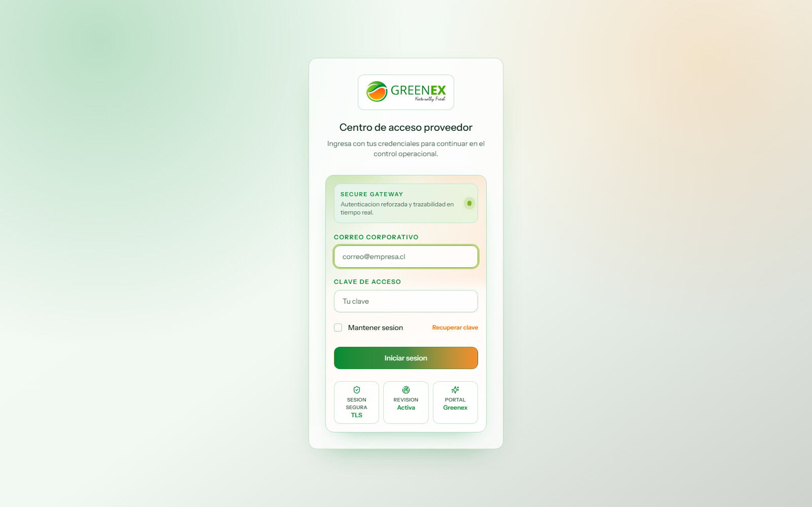
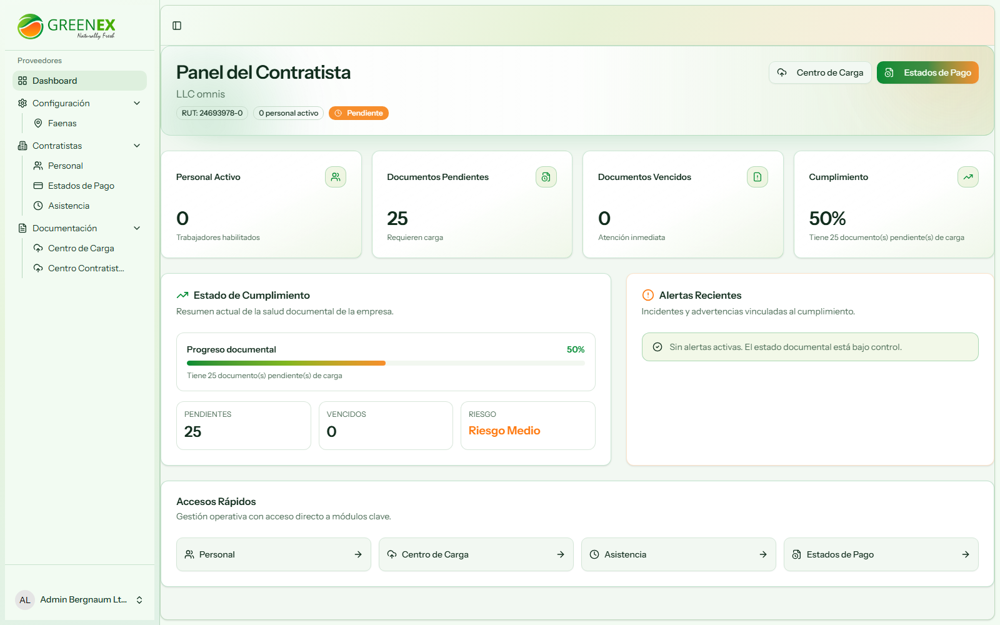
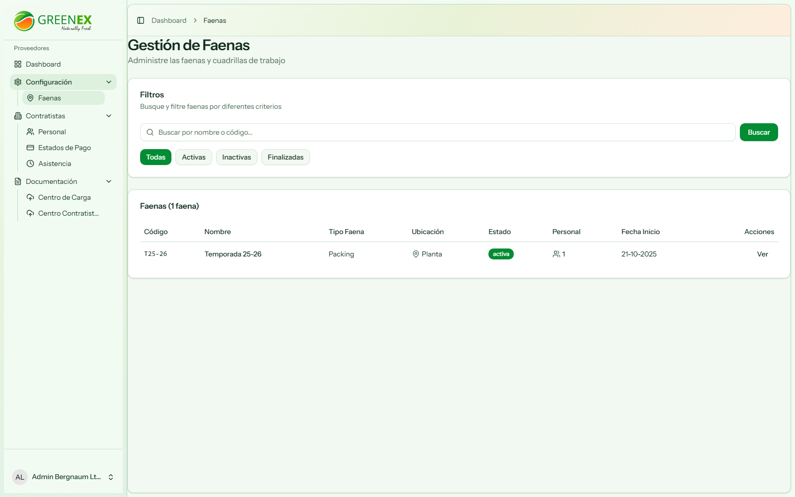
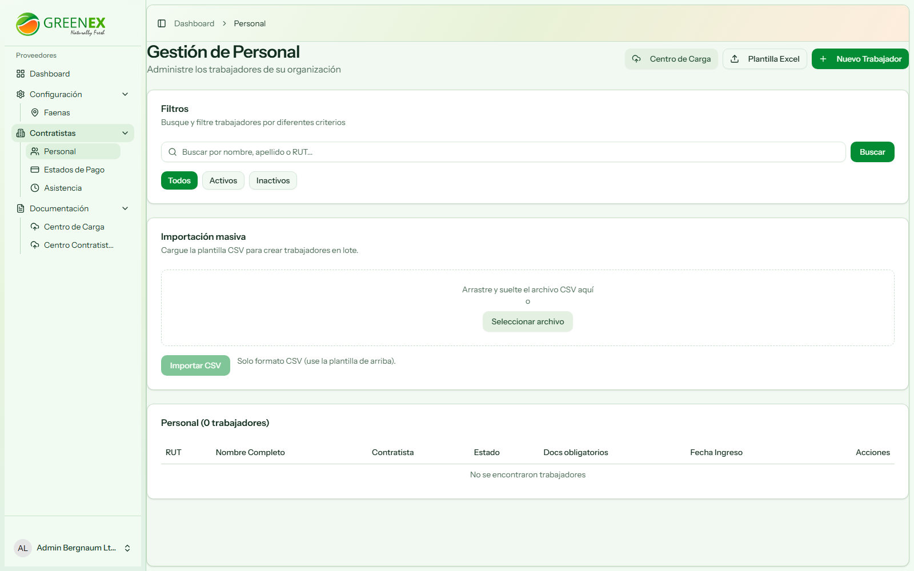
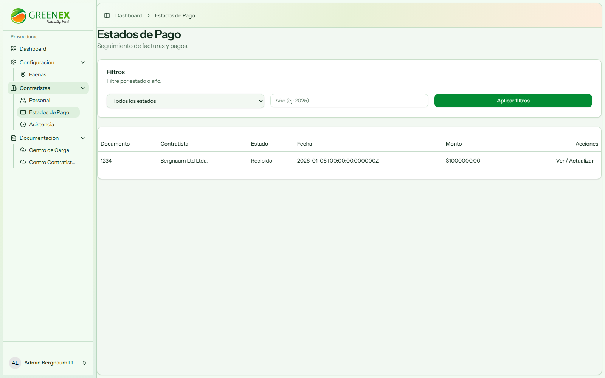
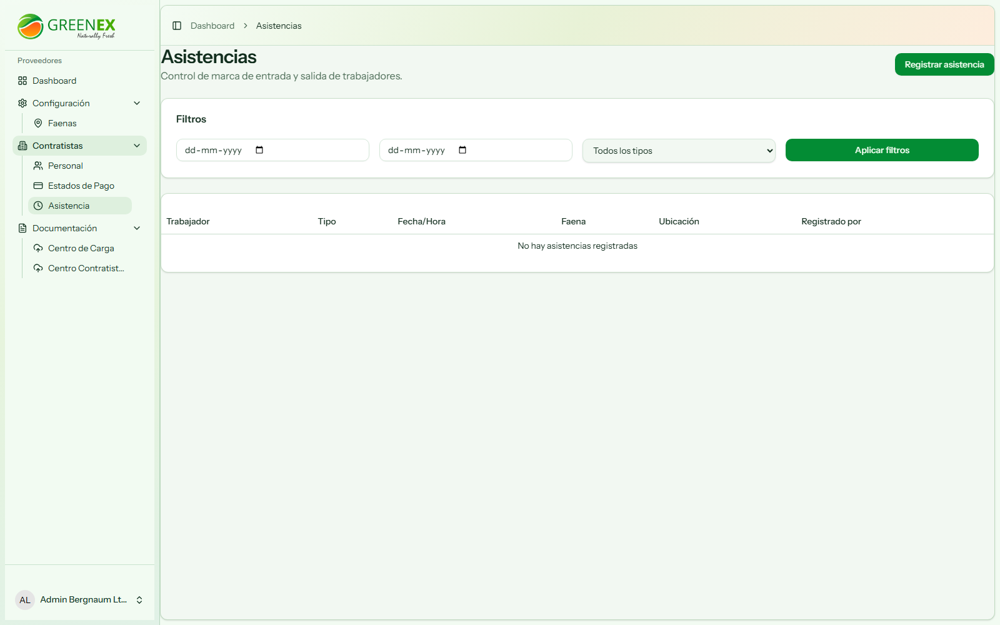
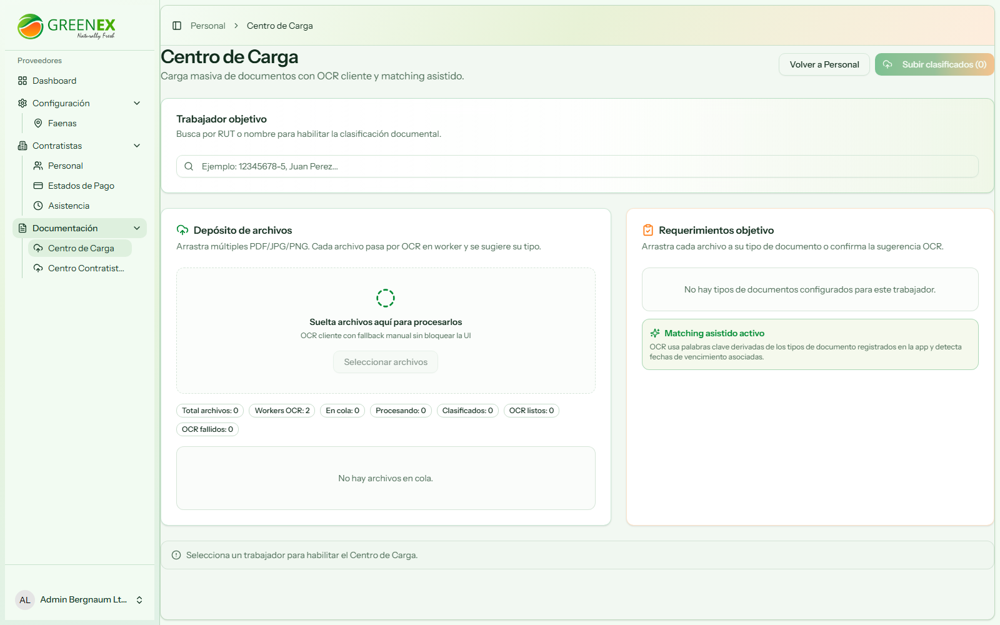
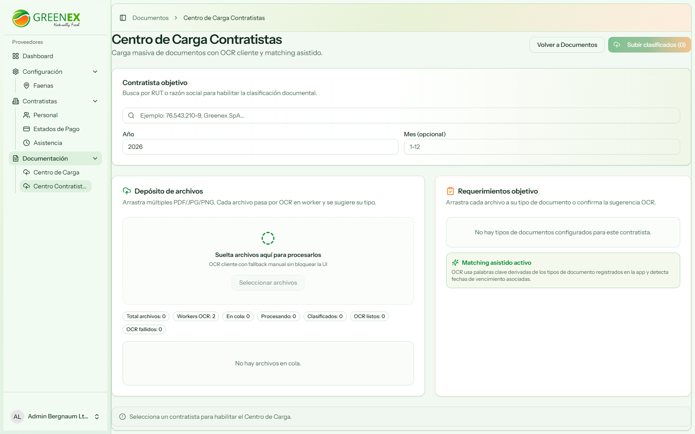
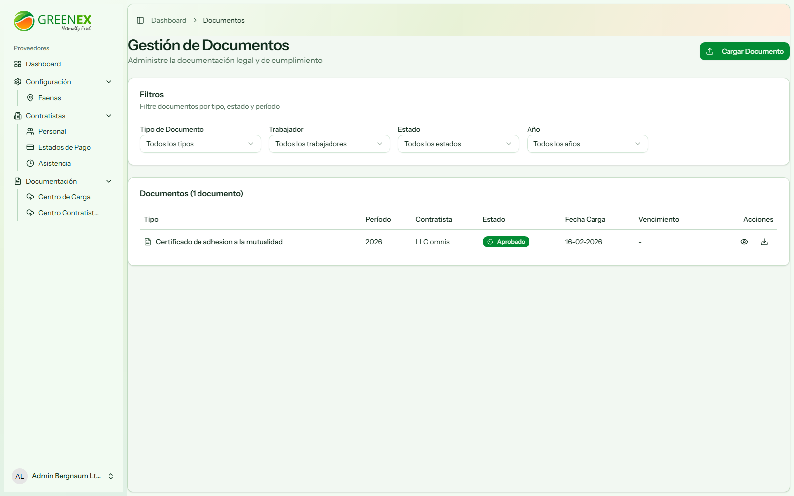

# Manual de Usuario - Contratista

## 1. Acceso al Portal

1. Ingrese a `https://portal_proveedores.test/login`.
2. Complete correo y contraseña entregados por el administrador.
3. Presione **Ingresar**.

## 2. Vista General del Dashboard

El dashboard muestra estado documental, alertas y accesos operativos.

## 3. Menú Disponible para Contratista

1. Dashboard
2. Configuración: Faenas (solo lectura operativa según permisos)
3. Contratistas: Personal, Estados de Pago, Asistencia
4. Documentación: Centro de Carga y Centro Contratistas

## 4. Configuración

### 4.1 Faenas

Consulta de faenas asignadas y contexto operativo.

## 5. Gestión Operativa

### 5.1 Personal

Administración del personal propio del contratista.

### 5.2 Estados de Pago

Seguimiento de estados de pago.

### 5.3 Asistencia

Control de asistencia de trabajadores.

## 6. Documentación

### 6.1 Centro de Carga

Carga de documentos de trabajadores con matching asistido.

### 6.2 Centro Contratistas

Carga de documentación de la empresa contratista.

### 6.3 Expediente Documental

Consulta de documentos cargados, estados y filtros.

## 7. Flujo Recomendado de Operación (Contratista)

1. Mantener personal actualizado.
2. Cargar documentos en Centro de Carga (trabajadores).
3. Cargar documentos corporativos en Centro Contratistas.
4. Revisar estado en Expediente Documental.
5. Corregir observaciones o rechazos para mantener cumplimiento.
